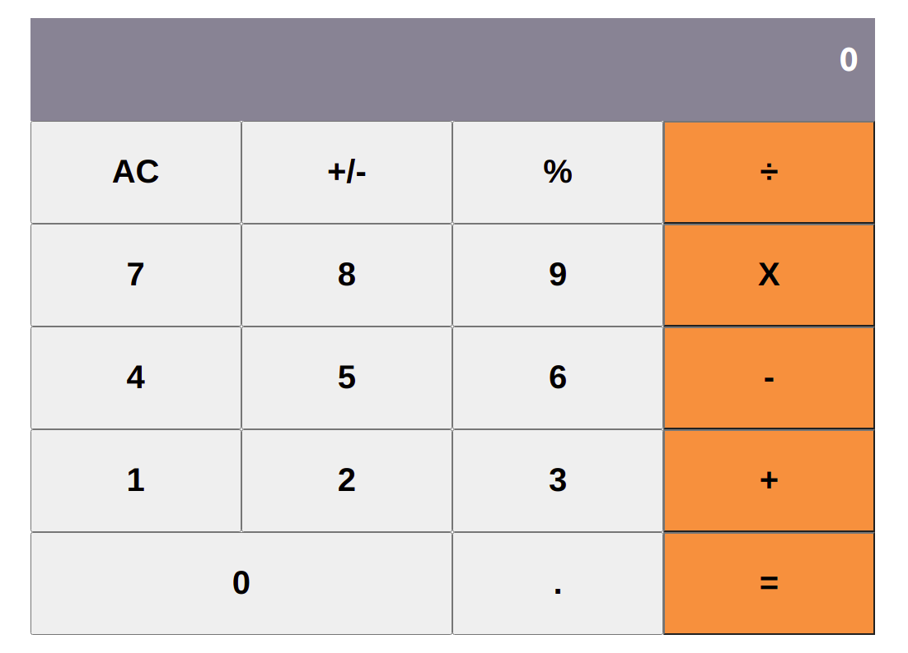

# React Calculator

A basic calculator developed using React.

## 🔴 Live Demo

**Click [here](https://react-calculator-temesghen.herokuapp.com/) in order to see a Live Demo of this project.**

### Search Page

## Project Specification

  - [ ] Use create-react-app to initialize a new React app
  - [ ] Add prop-types using npm for typechecking props.
  - [ ] Add big.js using npm.
  - [ ] Run the application with npm start and make sure that everything works correctly.
  - [ ] Use create-react-app-buildpack to deploy the app to Heroku

## Built With

 - [ ] Node.js
 - [ ] React
 - [ ] React-DOM
 - [ ] React-Create-App
 - [ ] npm
 - [ ] CSS
 - [ ] ES6

## Author

👤 **Temesghen Tekeste**

- Github: [@temesghentekeste](https://github.com/temesghentekeste)
- Twitter: [@temesghentekes1](https://twitter.com/temesghentekes1)
- Linkedin: [temsghen tekeste](https://www.linkedin.com/in/temesghentekeste/)

## 🤝 Contributing

Contributions, issues and feature requests are welcome!

Feel free to check the [issues page](https://github.com/temesghentekeste/react-calculator/issues).

## 👍 Show your support

Give a ⭐️ if you like this project!

## :clap: Acknowledgements
- <a href="https://www.microverse.org/" target="_blank">microverse.org</a>
- <a href="https://www.theodinproject.com/" target="_blank">The Odin Project</a>
</a>
